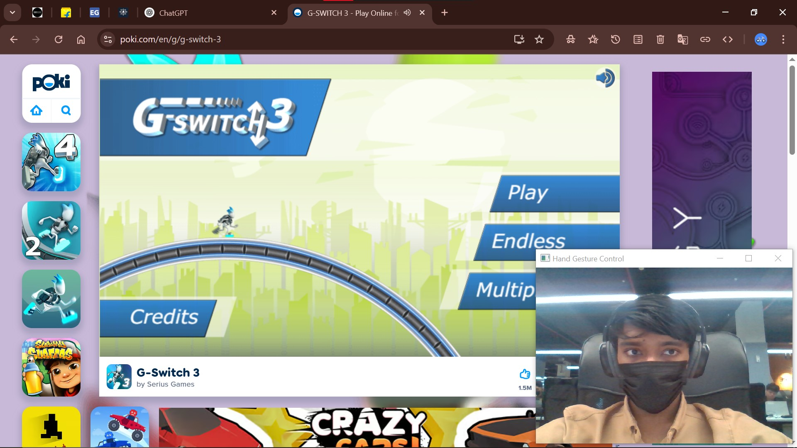

# Dino hand gesture


# 🖐️ Hand Gesture Control for Spacebar Press

This project allows you to control the **spacebar** on your keyboard using **hand gestures** detected via webcam. It’s especially useful for controlling simple games like the Google Chrome **Dino Game** or other applications requiring a spacebar press (e.g., jump in a game) without touching the keyboard.

## 🚀 Features

- Detects your hand in real time using **MediaPipe**
- Triggers a **spacebar press** when you make a fist (closed hand)
- Simple UI window always on top
- Cooldown to avoid multiple unintended presses

## 🛠️ Technologies Used

- [OpenCV](https://opencv.org/) – for video capture and display
- [MediaPipe](https://mediapipe.dev/) – for hand tracking
- [PyAutoGUI](https://pyautogui.readthedocs.io/en/latest/) – for simulating keyboard press
- [pygetwindow](https://pypi.org/project/PyGetWindow/) – for window management
- [pywin32](https://pypi.org/project/pywin32/) – to set the OpenCV window as always on top
- [NumPy](https://numpy.org/) – for image placeholder generation

## 📦 Installation

1. **Clone this repository** or copy the Python script.

2. **Install dependencies**:

    ```bash
    pip install opencv-python mediapipe pyautogui pygetwindow pywin32 numpy
    ```

3. **Run the script**:

    ```bash
    python dino.py
    ```

## 🖥️ How It Works

- It captures video from your webcam.
- Tracks your right hand using MediaPipe.
- If the index finger tip (landmark 8) is **below** its base joint (landmark 6), the hand is considered **closed** (like a fist).
- If the hand is detected as closed and wasn't closed in the last frame (with a cooldown of 0.5 seconds), a **spacebar press** is triggered.
- The OpenCV window displays your webcam feed and is set to stay **always on top** of other windows.

## 📷 Hand Gesture Logic

- **Open Hand** → Do nothing  
- **Closed Hand (fist)** → Press `space`

> Tip: You can play the Chrome Dino game or any simple game that responds to the `space` key using just your hand gestures!

## 🛑 Exit

Press **`q`** in the OpenCV window to exit the application.

## ⚠️ Troubleshooting

- If the window doesn't stay on top, make sure you're on Windows and `pywin32` is installed correctly.
- Make sure your camera is not used by another app.
- Try increasing lighting if the hand is not being detected.

## 📄 License

This project is open source and available under the [MIT License](LICENSE).
